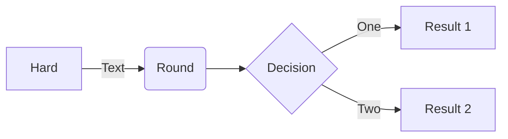
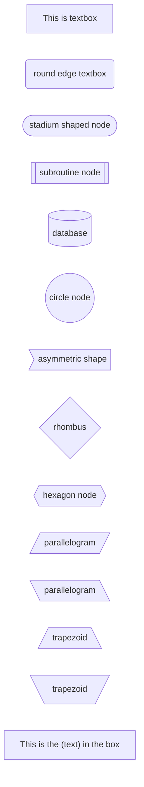
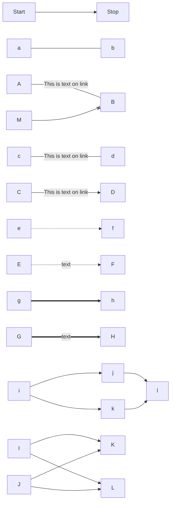
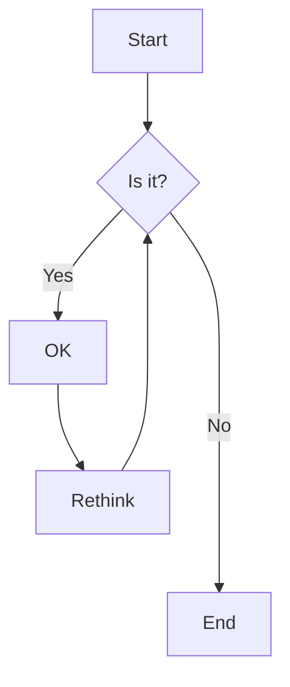
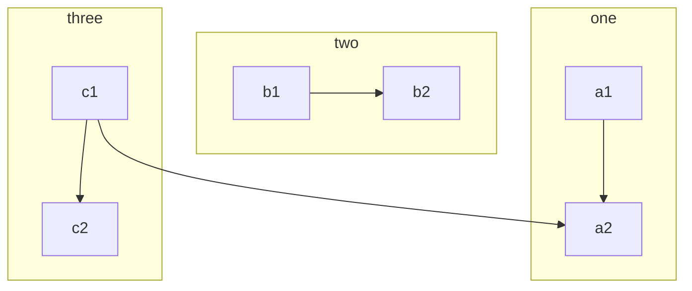
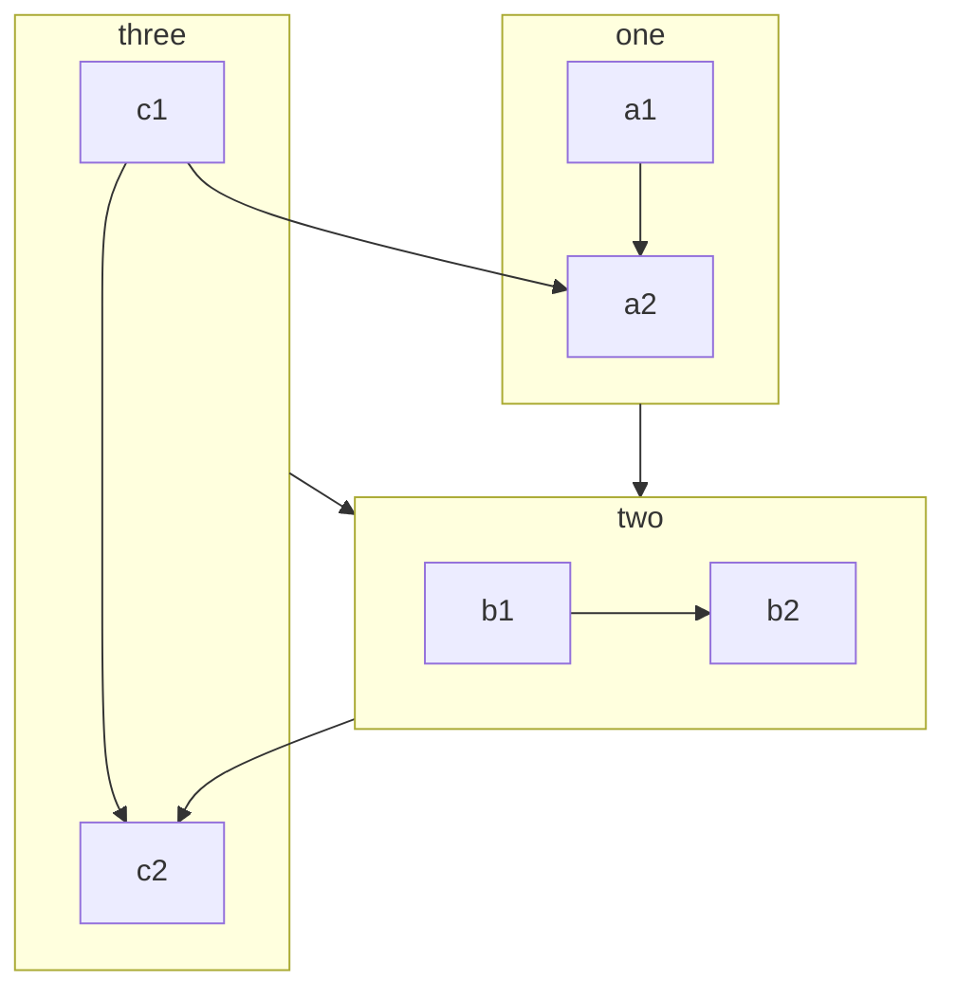
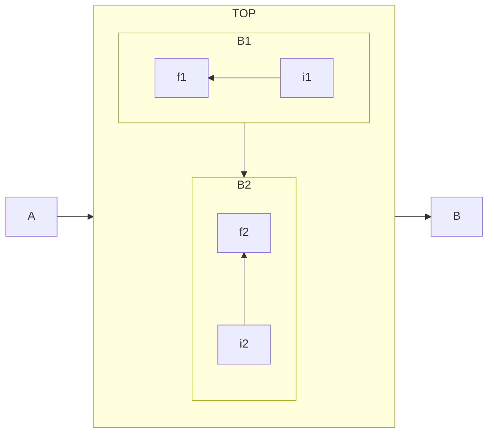

# go-rest-banking
https://www.udemy.com/course/rest-based-microservices-api-development-in-go-lang/learn/lecture/22630239#overview

## Nodes

## Links

go mod init github.com/ravikrs/go-rest-banking/s2  
go mod tidy 